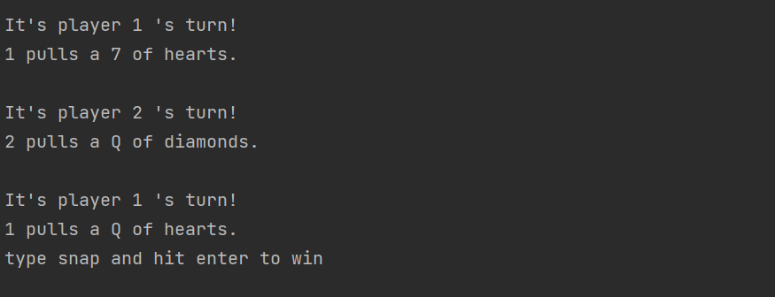

# Java Snap

---

## Table of Contents
- [Brief](#brief)
- [About](#about)
- [Screenshots](#screenshots)
- [Languages](#languages)
- [Code of Note](#code_of_note)

---

## Brief 

1. Using classes, ArrayLists and methods, create a deck of Cards.
2. implement methods to deal, shuffle, and sort
3. create a class for the game to run in
4. enable the snap game to be 2 player, with the users taking it in turns to go.
5. Add a timer on win

---

## About 

A snap game built entirely in Java. This was one of my first projects using Java. I separate methods into separate classes. The deck is produced from key value pairs and enums. I use a scanner to enable the game to be played in the command line.

---

## Screenshots 

---

## Languages 

- Java

---

## Code of Note 

- created the deck using a for loop
- enabled the deck to be pulled from infinitely by adding the pulled card to the bottom of the pile
